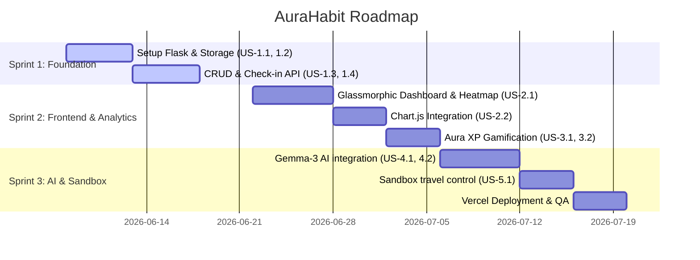

# ✨ AuraHabit - Agile Project Plan & Sprint Backlog

This document structures the development of the **AuraHabit Tracker & AI Companion** using Agile methodology, organizing the deliverables into epics, user stories, and a structured sprint schedule.

---

## 🎯 Product Vision
To build a premium, visually engaging, gamified habit tracker that helps users cultivate consistent routines by combining intuitive statistics, active streaks, and personal productivity guidance powered by artificial intelligence.

---

## 👥 Persona: Routine Builder (Alex)
*   **Bio**: A developer/student struggling to keep a consistent routine with exercise, reading, and coding.
*   **Needs**: Needs quick, daily check-in options, visual progress tracking that gives a sense of accomplishment (dopamine loop), and advice when motivation fades.

---

## 🗺️ Epic Map

### Epic 1: Core Habit Tracking Engine (Habit CRUD & Storage)
*   **Goal**: Establish a stable backend API and database storage to register, retrieve, modify, and delete habits with thread safety.

### Epic 2: Visual Analytics & Analytics Flow (Heatmap & Charts)
*   **Goal**: Create a premium glassmorphic dashboard visualizing habit streaks, weekly compliance rate, and calendar consistency.

### Epic 3: Aura XP Gamification (Leveling & Badges)
*   **Goal**: Introduce a progress reward loop where check-ins unlock achievements and level up the user's "Aura Power".

### Epic 4: Aura AI Coach (Gemma-3 Integration)
*   **Goal**: Provide users with personalized motivational advice using a Large Language Model with visible logical thought processes.

---

## 📋 Product Backlog (User Stories)

| ID | User Story | Effort (Story Points) | Epic | Priority |
| :--- | :--- | :--- | :--- | :--- |
| **US-1.1** | As a user, I want to create a new habit specifying its name, description, and category, so that I can define my goals. | 3 | Core Engine | High |
| **US-1.2** | As a user, I want to view my list of daily habits, so that I know what routines I need to perform. | 3 | Core Engine | High |
| **US-1.3** | As a user, I want to check in/complete a habit for the day, so that I can build a streak. | 5 | Core Engine | High |
| **US-1.4** | As a user, I want to edit or delete a habit, so that I can adapt my routines as my lifestyle changes. | 2 | Core Engine | Medium |
| **US-2.1** | As a user, I want to view a 105-day (15-week) contribution heatmap, so that I can visualize my consistency at a glance. | 8 | Visual Analytics | High |
| **US-2.2** | As a user, I want to view category distributions and weekly trend charts, so that I can see where I spend my efforts. | 5 | Visual Analytics | Medium |
| **US-3.1** | As a user, I want to earn XP for completions and active streaks, so that I feel rewarded for consistency. | 5 | Gamification | High |
| **US-3.2** | As a user, I want to unlock specific achievement badges (e.g., 7-day streak), so that I have milestones to aim for. | 5 | Gamification | Medium |
| **US-4.1** | As a user, I want to chat with an AI productivity coach, so that I can get motivational advice and tips. | 8 | AI Coach | Medium |
| **US-4.2** | As a user, I want to view the AI's logical reasoning thought process, so that I can understand how it formulated its advice. | 3 | AI Coach | Low |
| **US-5.1** | As a developer, I want a Sandbox timezone date control, so that I can time-travel and verify streak rules immediately. | 3 | Testing/Utility | Low |

---

## 📅 Sprint Planning (3 Sprints, 2-Week Iterations)

### 🏃 Sprint 1: Core Habit Tracking Infrastructure (The Foundation)
*   **Objective**: Deliver a functioning REST API for habits CRUD and local database persistence.
*   **Committed Backlog**: `US-1.1`, `US-1.2`, `US-1.3`, `US-1.4`.
*   **Key Files Created/Modified**:
    *   [app.py](file:///c:/Users/Sankari%20Sabarikanth/Downloads/sankari/app.py) (Initialization)
    *   [storage.py](file:///c:/Users/Sankari%20Sabarikanth/Downloads/sankari/storage.py) (Thread-safe memory DB)
    *   [routes/habit_routes.py](file:///c:/Users/Sankari%20Sabarikanth/Downloads/sankari/routes/habit_routes.py) (CRUD Endpoints)
    *   [services/habit_service.py](file:///c:/Users/Sankari%20Sabarikanth/Downloads/sankari/services/habit_service.py) (Streak calculations)
    *   [utils/date_utils.py](file:///c:/Users/Sankari%20Sabarikanth/Downloads/sankari/utils/date_utils.py) (Date logic)

#### 📝 Sprint 1 Acceptance Criteria Example (`US-1.3` - Check-in):
*   **Scenario: Successful Check-in**
    *   **Given**: A habit with ID `abc-123` exists.
    *   **When**: A `POST` request is sent to `/api/habits/abc-123/checkin` with JSON `{ "date": "2026-06-05" }`.
    *   **Then**: Returns `200 OK` status, appends the date to completions list, increments `streak_current` to `1`, and updates completion percentage.
*   **Scenario: Duplicate Check-in Prevention**
    *   **Given**: Habit `abc-123` was already checked in on `2026-06-05`.
    *   **When**: A check-in request is sent for the same date.
    *   **Then**: Reject with `400 Bad Request` and return an error message: `"Habit was already completed on 2026-06-05"`.

---

### 🏃 Sprint 2: Frontend UI & Gamification Engine
*   **Objective**: Integrate visual trackers and the level-up experience reward loop.
*   **Committed Backlog**: `US-2.1`, `US-2.2`, `US-3.1`, `US-3.2`.
*   **Key Files Created/Modified**:
    *   [templates/index.html](file:///c:/Users/Sankari%20Sabarikanth/Downloads/sankari/templates/index.html) (CSS Layout / JS Chart initialization)
    *   [static/css/style.css](file:///c:/Users/Sankari%20Sabarikanth/Downloads/sankari/static/css/style.css) (CSS glow cells and XP progressions)
    *   [services/habit_service.py](file:///c:/Users/Sankari%20Sabarikanth/Downloads/sankari/services/habit_service.py) (XP calculation functions)

#### 📝 Sprint 2 Acceptance Criteria Example (`US-3.1` - XP Accumulation):
*   **Given**: User has `0 XP` and is at `Level 1`.
*   **When**: User checks in to a habit.
*   **Then**: User receives `+20 XP`.
*   **And**: If that check-in unlocks a badge (e.g. `First Step` badge), user receives an additional `+100 XP` bonus.
*   **And**: Level updates automatically using the quadratic progression logic: `Level = floor(sqrt(XP / 100)) + 1`.

---

### 🏃 Sprint 3: Intelligence & Deployment Configuration
*   **Objective**: Incorporate the AI assistant chatbot, implement sandbox time-travel, and build/deploy to Vercel production.
*   **Committed Backlog**: `US-4.1`, `US-4.2`, `US-5.1`.
*   **Key Files Created/Modified**:
    *   [services/ai_service.py](file:///c:/Users/Sankari%20Sabarikanth/Downloads/sankari/services/ai_service.py) (NVIDIA Completions requests handler)
    *   [vercel.json](file:///c:/Users/Sankari%20Sabarikanth/Downloads/sankari/vercel.json) (Build directions)
    *   [requirements.txt](file:///c:/Users/Sankari%20Sabarikanth/Downloads/sankari/requirements.txt) (Dependency lists)
    *   [templates/base.html](file:///c:/Users/Sankari%20Sabarikanth/Downloads/sankari/templates/base.html) (Sandbox Travel Date selectors)

#### 📝 Sprint 3 Acceptance Criteria Example (`US-4.1` - Chatbot):
*   **Given**: User types a productivity query in the "Aura Coach" panel.
*   **When**: User submits the chat input form.
*   **Then**: A REST POST request is sent to `/api/coach/chat`.
*   **And**: Endpoint returns a JSON containing AI content recommendation along with the `reasoning_content` detailing logical steps.
*   **And**: Dashboard renders the chat bubble alongside a collapsible button displaying the reasoning breakdown.
