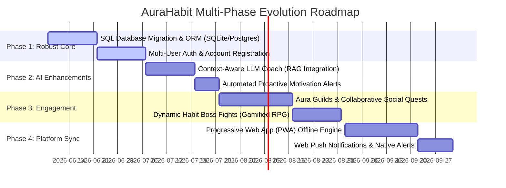
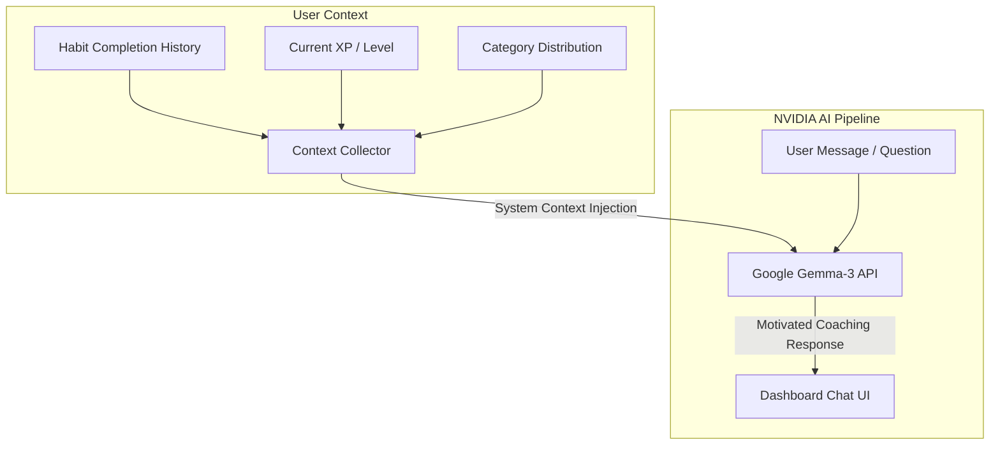

# 🗺️ AuraHabit: Future Roadmap & Product Expansion Ideas

This roadmap details the future architectural and feature-based evolution of **AuraHabit**. These recommendations build upon the existing glassmorphic dashboard, gamification XP mechanics, and NVIDIA Gemma-3 AI coach backend.

---

## 📅 High-Level Timeline & Milestones

The proposed features are categorized into four tactical phases.



---

## 🛠️ Detailed Feature Descriptions

### Phase 1: Foundation & Data Durability (Core Infrastructure)
*Goal: Evolve AuraHabit from an in-memory single-user prototype to a production-ready, multi-user SaaS platform.*

| Feature Area | Technical Approach & Stack | User Impact |
| :--- | :--- | :--- |
| **SQL Database Migration** | Replace the in-memory `storage.py` thread-locked dictionary with **SQLite** (local development) and **PostgreSQL** (production deployment on Vercel/Supabase) utilizing **Flask-SQLAlchemy**. | User data survives app restarts and serverless container recycles. |
| **User Accounts & Session Auth** | Implement **Flask-Login** and password hashing with `werkzeug.security`. Add sign-up, sign-in, and profile dashboard views. | Enables private habit accounts. Users can sync their habits across multiple devices. |
| **Data Backup & Import/Export** | Extend the current JSON export endpoint to allow importing habits and completions histories from standard habit tracking files. | Prevents vendor lock-in and gives users security over their tracking history. |

> [!IMPORTANT]
> Because Vercel functions are serverless, in-memory states in the current `storage.py` are wiped out whenever the lambda instance goes idle. Migrating to a hosted SQL database (such as Supabase or Neon Tech PostgreSQL) is the most critical item on the roadmap to enable true persistent deployments.

---

### Phase 2: Hyper-Personalized AI Coaching (Intelligence)
*Goal: Deepen the connection between the NVIDIA Gemma-3 AI Coach and the user's actual productivity habits.*



*   **Context-Aware System Prompting**:
    *   Inject the user's current progress metrics (number of active habits, current streak levels, highest category completion rate) directly into the system prompt when invoking `/api/coach/chat`.
    *   *Example Prompt Injection:* `"You are coaching a user who is currently Level 5, has a 12-day streak on 'Daily Coding', and has missed their 'Meditation' habit for 3 consecutive days."*
*   **Predictive Analytics & AI Nudges**:
    *   Implement basic regression models or rule-based heuristics that flag when a user is likely to break a streak (e.g., if they typically check-in by 9 AM but it is now 4 PM).
    *   Display pre-emptive micro-reminders generated by Gemma-3 directly on the dashboard.

---

### Phase 3: RPG Gamification & Social Sync (Engagement Loop)
*Goal: Enhance the dopamine reward loops by making habit completion feel like an immersive role-playing game (RPG) with friends.*

*   **Aura Guilds (Collaborative Streaks)**:
    *   Users can create or join Guilds (e.g., "Web Developers", "Morning Runners").
    *   Guild XP pools where the collective streaks of all members unlock guild levels and special guild badges.
*   **Habit Boss Fights**:
    *   Introduce daily or weekly bosses (e.g., "The Procrastination Dragon").
    *   Every habit check-in deals damage to the boss. Failing to complete a habit deals damage to the player's health points (HP).
    *   Defeating bosses unlocks rare glassmorphic badge designs and avatar frames.

> [!TIP]
> Integrating gamified elements like boss battles creates a collaborative social contract and leverages loss aversion (failing a habit hurts your character/team), significantly boosting daily retention.

---

### Phase 4: Offline-First PWA & Mobile Native Experience (Convenience)
*Goal: Make checking in as immediate and seamless as clicking a widget on a mobile device.*

1.  **Service Worker Caching**:
    *   Configure service worker scripts to cache CSS variables, glassmorphic layout templates, and core Chart.js bundles.
    *   Ensure the dashboard renders instantly even in low-bandwidth or offline environments.
2.  **Local-First Database Sync**:
    *   Save check-ins to the browser's `IndexedDB` when offline.
    *   Automatically sync pending check-ins with the Flask database engine via a background sync API when connectivity returns.
3.  **Web Push Notifications**:
    *   Set up a Web Push service using the VAPID protocol.
    *   Deliver customizable daily reminders at times chosen by the user, bypassing the need to have the tab open.

---

## 🛠️ Implementation Plan for Phase 1 (Database Migration)

Here is a recommended setup pattern for transitioning storage from memory to database:

```python
# [NEW] models.py
from flask_sqlalchemy import SQLAlchemy
from datetime import datetime

db = SQLAlchemy()

class User(db.Model):
    id = db.Column(db.String(36), primary_key=True)
    username = db.Column(db.String(80), unique=True, nullable=False)
    password_hash = db.Column(db.String(128), nullable=False)
    created_at = db.Column(db.DateTime, default=datetime.utcnow)
    habits = db.relationship('Habit', backref='user', lazy=True)

class Habit(db.Model):
    id = db.Column(db.String(36), primary_key=True)
    user_id = db.Column(db.String(36), db.ForeignKey('user.id'), nullable=False)
    name = db.Column(db.String(100), nullable=False)
    description = db.Column(db.Text, nullable=True)
    category = db.Column(db.String(50), default='Other')
    created_at = db.Column(db.String(10), nullable=False) # YYYY-MM-DD
    completions = db.relationship('Completion', backref='habit', lazy=True, cascade="all, delete-orphan")

class Completion(db.Model):
    id = db.Column(db.Integer, primary_key=True)
    habit_id = db.Column(db.String(36), db.ForeignKey('habit.id'), nullable=False)
    completion_date = db.Column(db.String(10), nullable=False) # YYYY-MM-DD
```
