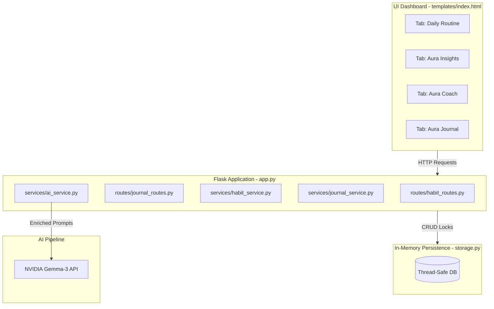

# 📓 AuraHabit: Project Development Journal

This journal chronicles the engineering journey, architectural milestones, and product features implemented during the creation of **AuraHabit**—a premium, visually stunning, gamified habit tracker and AI companion.

---

## 🌟 Project Vision & Core Architecture
AuraHabit was designed to bridge the gap between simple habit logs and immersive gamified retention loops. It utilizes a **Flask backend** connected to a **thread-safe memory database** for rapid prototype responsiveness, rendering a client-side **glassmorphic dashboard** with premium CSS lighting and visual analytics, and incorporates **NVIDIA's Gemma-3 LLM** as a personalized mental coach.

---

## 📅 Chronological Development Logs

### 🪵 Log Entry 1: Core Habit Tracking Engine (Sprint 1)
*Goal: Establish a stable REST API, schema, and thread-safe data access controls for basic habit management.*
- **Backend Persistence**: Developed [storage.py](file:///c:/Users/Sankari%20Sabarikanth/Downloads/sankari/storage.py), a thread-locked in-memory store utilizing Python's `threading.Lock` to guarantee safe concurrent reads/writes for serverless or multi-client environments.
- **Service & Streak Calculations**: Implemented [habit_service.py](file:///c:/Users/Sankari%20Sabarikanth/Downloads/sankari/services/habit_service.py) containing calculations in [date_utils.py](file:///c:/Users/Sankari%20Sabarikanth/Downloads/sankari/utils/date_utils.py) to compute:
  - **Current Streak**: Active running streak. Breaks if a user misses checking in yesterday and today.
  - **Longest Streak**: Historical record high check-in streak.
  - **Aura Strength**: The percentage of days completed since the habit's creation.
- **REST Endpoints**: Created [habit_routes.py](file:///c:/Users/Sankari%20Sabarikanth/Downloads/sankari/routes/habit_routes.py) exposing:
  - `POST /api/habits` (Create habit with Category validation: *Health, Fitness, Reading, Study, Work, Personal, Other*).
  - `GET /api/habits` & `GET /api/habits/<id>` (Retrieval).
  - `PUT /api/habits/<id>` & `DELETE /api/habits/<id>` (Updates & Cleanup).
  - `POST /api/habits/<id>/checkin` (Check-in endpoint with duplicate date check prevention).

---

### 🎨 Log Entry 2: Premium UI Dashboard & XP Gamification (Sprint 2)
*Goal: Design a visually stunning, responsive interface that rewards consistency and hooks user retention.*
- **Glassmorphic Theme**: Designed [style.css](file:///c:/Users/Sankari%20Sabarikanth/Downloads/sankari/static/css/style.css) with multi-layered background gradients, custom ambient blurred glow points, glass panels (`backdrop-filter`), and CSS animations.
- **Aura Power XP Mechanics**: Integrated a leveling engine in `habit_service.py`:
  - completion awards **+20 XP**.
  - Current streak champion awards **+10 XP** per active day.
  - Level follows a quadratic curve: $\text{Level} = \lfloor\sqrt{\text{XP}/100}\rfloor + 1$.
- **Achievement Badges**: Created 6 unlockable milestone badges (e.g. *First Step, Consistency Starter, Habit Master, Explorer, Aura Legend*). Unlocking a badge awards a **+100 XP** bonus.
- **Flow Visualizations**: Integrated **Chart.js** and calendar heatmaps in the dashboard:
  - **Aura Flow Heatmap**: A 15-week (105 days) calendar grid showing intensity levels based on daily compliance percentages (similar to GitHub contributions).
  - **Category Doughnut Chart**: Displays distribution of routines.
  - **14-Day Completion Trend**: Line chart tracking habit strength.
  - **Weekly Compliance Bars**: 7-day retrospective checklist bars.

---

### 🤖 Log Entry 3: AI Companion & Sandbox Controls (Sprint 3)
*Goal: Integrate cognitive motivation counseling and timezone manipulation utilities.*
- **NVIDIA Gemma-3 Integration**: Implemented [ai_service.py](file:///c:/Users/Sankari%20Sabarikanth/Downloads/sankari/services/ai_service.py) connecting to Gemma-3.
- **Reasoning viewer**: Built a UI detail element that displays Gemma's logical thinking/reasoning process alongside the main response, showing how the coach formulated its advice.
- **Sandbox Time-Travel**: Created a date controller in [base.html](file:///c:/Users/Sankari%20Sabarikanth/Downloads/sankari/templates/base.html) which updates `localStorage.sandbox_date`. Allows developers and users to time-travel across days and verify streak decay rules instantly without waiting real-time.

---

### 📝 Log Entry 4: The Aura Journal Integration (Feature Add-on)
*Goal: Combine mindset logs, emotional mood analysis, and routine links to personalize the coaching loop.*
- **Storage Expansion**: Added journal lists and CRUD operations inside `storage.py`.
- **Journal Service & Validation**: Built [journal_service.py](file:///c:/Users/Sankari%20Sabarikanth/Downloads/sankari/services/journal_service.py) enforcing a **one-journal-entry-per-day** limit to prevent cluttered timelines and keeping users focused on daily reflections.
- **Habit-Linking API**: Developed [journal_routes.py](file:///c:/Users/Sankari%20Sabarikanth/Downloads/sankari/routes/journal_routes.py) allowing users to check-box and link their reflections directly to habits active on that sandbox date.
- **AI Context Injections**: Upgraded `ai_service.py` to compile user stats (XP, level, completion status) and recent journal entries (mood ratings, reflection notes, titles). The coach is now fully aware of the user's emotional state, giving targeted encouragement (e.g. *focusing on low moods or tiredness*).
- **UI & Mood Grid**: Constructed the **Aura Journal** dashboard panel containing title fields, 5 glowing mood buttons (😊, 🙂, 😐, 🥱, 🙁), linked habit checklists, and chronological Past Reflections logs.

---

### 💾 Log Entry 5: Persistent SQLite Database Migration (Sprint 4)
*Goal: Replace unstable in-memory store with relational, file-backed SQL database persistence.*
- **Relational Schema Design**: Created tables for habits, completions, journals, and a linking join table for journal-habit relationships in [storage.py](file:///c:/Users/Sankari%20Sabarikanth/Downloads/sankari/storage.py).
- **API Compatibility Layer**: Implemented `SQLStorage` that acts as a drop-in replacement conforming to the exact dict-based interfaces.
- **Cascade and Integrity Controls**: Enabled foreign key cascades so delete requests safely cascade without dangling keys.
- **Environment Isolation**: Configured storage to run tests on `habits_test.db` dynamically while real runs persist to `habits.db`.

---

## 📈 Quality Assurance Summary
- Created a robust test suite in [test_app.py](file:///c:/Users/Sankari%20Sabarikanth/Downloads/sankari/test_app.py) verifying:
  - Streak calculation rules and edge case gaps.
  - CRUD operations for habits and daily check-ins.
  - Gamification level curves and badge status updates.
  - Daily journal CRUD operations, linked habit checks, and duplicate-date validation exceptions.
  - **SQLite Compatibility**: Validated database connection routines, relational cascade deletes, and data-shape conversions under test workloads.
- **Test execution status**: `25 tests ran. 25 tests passed. (100% OK)` using SQLite storage engine.
